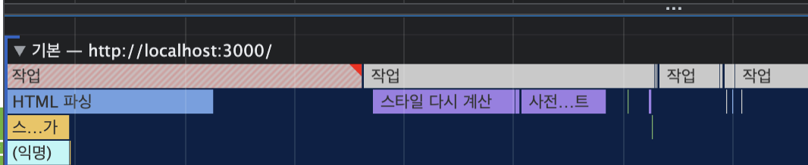
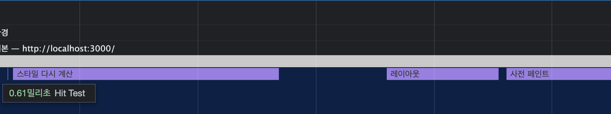
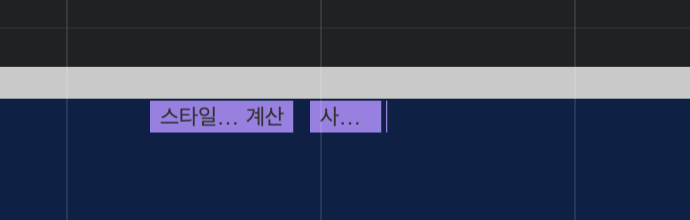
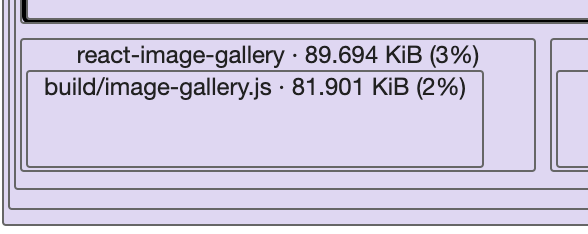
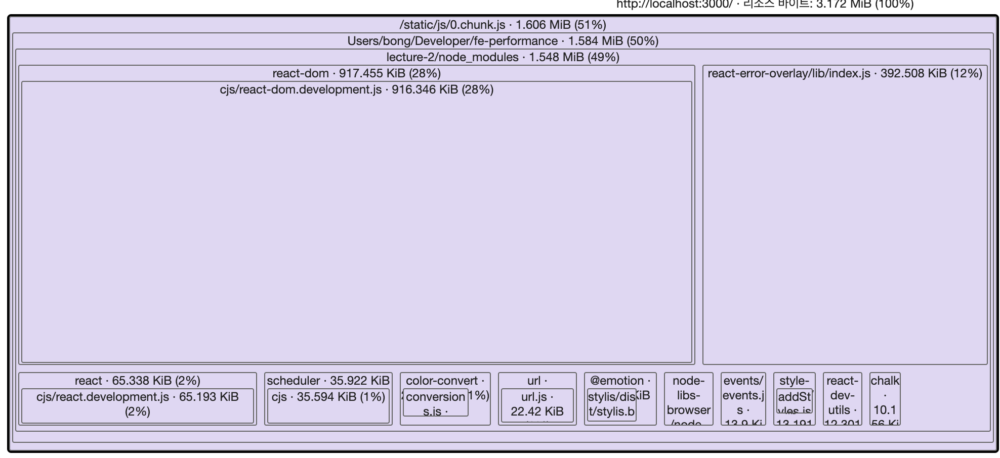
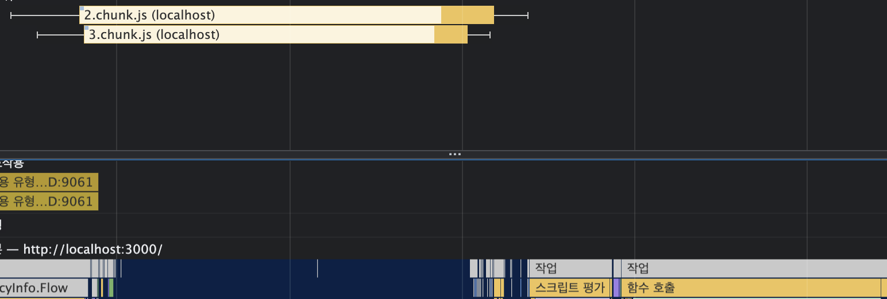
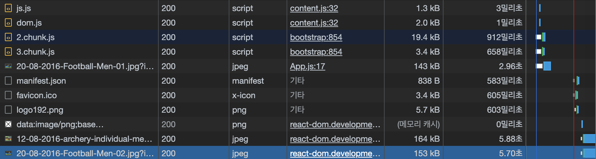

# fe 성능 최적화 #2 올림픽 통계 서비스 최저화

## 소개

- 사진 , 막대 그래프, 애니메이션이 포함된 웹 서비스 최적화
- 최적화 내용
  - CSS 애니메이션 최적화
  - 컴포넌트 지연 로딩
  - 컴포넌트 사전 로딩
  - 이미지 사전 로딩
- 코드 분석
  ```jsx
  {
    showModal ? (
      <ImageModal
        closeModal={() => {
          setShowModal(false);
        }}
      />
    ) : null;
  }
  ```
  - ImageModal 이 showModal이 true가 될 때, 생성되면서 초기 지연이 발생.
  - ImageModal 컴포넌트의 코드에서 외부 라이브러리를 사용한다는 점 ⇒ 번들링 사이즈가 커진다 ⇒ 서비스의 자바스크립트를 로드하는데 시간이 오래걸린다.
  - Bar컴포넌트에서 percent prop에 따라 막대 그래프의 가로 길이를 조정하는 속성.
    브라우저의 원리를 알면, 이 코드가 불편해.

## 애니메이션 최적화

- 쟁크(jank) 현상이 발생하고 있음
- 현재 작동 방식
  ```jsx
  width: ${(width) => width}%;
  transitions: width 1.5s ease;
  ```
- 애니메이션은 여러 장의 사진이 주루륵 나와서 진행하는 것
- 모니터가 60FPS 로 돌아가는데, 컴퓨터는 1초에 30장 밖에 못그려내면 → jank 현상
- But WHY?

### 브라우저 렌더링 과정

- 주요 렌더링 경로 (픽셀 파이프라인)
  - DOM + CSSOM > 렌더 트리 > 레이아웃 > 페인트 > 컴포지트
- DOM + CSSOM
  - HTML, CSS 등 화면을 그리는데 필요한 리소스를 다운로드 함.
  - HTML은 브라우저가 이해할 수 있는 형태로 변환하는 파싱 과정 거침.
  - 요소 간의 관계가 트리구조로 표현되어 있는 DOM을 만들어.
  - CSS도 HTML과 유사한 과정을 거쳐 CSSOM(CSS Object Model)이라는 트리 구조가 생성됨.
  - 해당 CSSOM은 각 요소가 어떤 스타일을 포함하고 있는지에 대한 정보를 포함하고 있음.
- 렌더트리

  - DOM과 CSSOM의 결합으로 생성됨.
  - 화면에 효시되는 각 요소의 레이아웃을 계산하는데 사용됨.
    <aside>
    💡 display: none; 으로 설정되어 화면에 표시되지 않는 요소는 렌더트리에 포함 X
    display: none;는 렌더트리에 포함되지 않지만, opacity:0 이나 visibility: hidden; 인 요소는 렌더 트리에 포함됨.

    </aside>

- 레이아웃
  - 화면 구성 요소의 위치나 크기를 계산하고, 해당 위치에 요소를 배치하는 작업을 함.
- 페인트
  - 화면에 요소의 위치와 크기를 잡았음 → 색을 입혀야지
  - 배경 색을 채워 넣거나 글자 색을 결정하거나 테두리 색을 변경함.
  - 이때 브라우저는 효율적인 페인트 과정을 위해 구성 요소를 여러 개의 레이어로 나누어 작업함.
- 컴포지트
  - 각 레이어를 합성하는 작업 진행
    - 페인트 단계에서 브라우저는 화면을 그릴때, 여러 개의 레이어로 화면을 쪼개어 그림.
    - 그리고 그 레이어들을 하나로 합성하는 단계가, 컴포지트 단계

### Performance 탭



- 회색 세로 점선: 화면을 갱신하는 주기

### 리플로우 & 리페인트

- 처음 화면이 모두 그려진 이후에, 스타일을 변경하거나 추가 제거하면?
  - 주요 렌더링 과정을 다시 한 번 실행하면서 새로운 화면을 그림
    ⇒ 이것을 **리플로우(혹은 리페인트)**라고 함.
- 리플로우 예시 (리페인트와는 살짝 다름)
  - width의 스타일 요소의 변경 ⇒ CSSOM을 새롭게 만들자.
  - CSSOM으로 렌더트리 생성
  - 레이아웃 단계에서 요소의 크리와 위치를 다시 고려.
  - 페인트 단계 이후, 컴포지트 진행.
- 리플로우는 주요 렌더링의 모든 단계를 재실행하기 때문에 브라우저 리소스를 많이 사용함.

<aside>
💡 리플로우: position, display, width, float, top, left 등등
리페인트: background, color, border-radius 등등

</aside>

- 단, **리페인트 과정의 경우에는 레이아웃 단계가 실행되지는 않음**

### 하드웨어 가속 (GPU 가속)

- 하드웨어 가속
  - 리플로우와 리페인트를 피하는 방법.
  - transform과 opacity와 같은 속성을 사용하면 GPU에 작업을 위임함.
  - 해당 속성을 활용하면, 해당 요소를 별도의 레이어로 분리하고 작업을 GPU에 위임하여 처리함.
  - 레이아웃 단계와 페이트 단계를 건너 뛸 수 있음 ⇒ **하드웨어 가속**
- 특정 요소에 하드웨어 가속을 사용하려면 요소를 별도의 레이어로 분리하여 GPU로 보내야 함.
  - 이 역할을 transform과 opacity이 함.
  - 분리된 레이어는 GPU에 의해 처리되어 레이아웃 단계와 리페인트 단계 없이 화면상의 요소의 스타일을 변경할 수 있음.

<aside>
💡 transform: translate()는 처음부터 레이어를 분리하지 않고, 변화가 일어나는 순간 레이어를 분리함.
반면에 **translate3d(), scale3d()와 같은 3d 속성 혹은 will-change 속성**은 **처음부터 레이어를 분리**해두기 때문에, 변화에 더욱 빠르게 대처할 수 있음.
단, 메모리를 더 많이 차지한다는 소리이기도 함.

</aside>

- 회색 선이 브라우저가 화면을 갱신하는 시간인데, 리페인트(리플로우) 작업이 이것을 넘겨버림.



### 애니메이션 최적화

- width 속성을 trasform의 scaleX 로 변경
  
  ```css
  width: 100%;
  transform: scaleX($ {({width}) => width / 100});
  transform-origin: center left; // 만약에 설정을 안하면, 가운데 정렬이 되어버림.
  transition: transform 1.5s ease;
  ```
- transform-origin: center left; // 만약에 설정을 안하면, 가운데 정렬이 되어버림.
  - scale의 기준점이 중앙에 위치하고 있기 때문에.

## 컴포넌트 지연 로딩 lazy loading

- 블로그 서비스에서는 페이지를 기준으로 코드를 분할했었음. (페이지가 필요한 시점에)

### 번들파일 분석



- 모달을 사용하면서, 활용하는 image-gallery의 비중이 큰 것을 확인할 수 있음 (물론… 작은편)

### 모달 코드 분리하기

- 1장 블로그와 마찬가지로 lazy와 Suspense 활용
  - image-gallery뿐 아니라, 초기 화면 구성에 필요없는 모달 전체를 지연로딩으로 분리함.
  ```jsx
  const ImageModal = React.lazy(() => import('./components/ImageModal'));
  ///...
  <Suspense fallback={null}>//....</Suspense>;
  ```
- 결과(초기 화면에 image-gallery관련 번들에 포함되지 않음)
  - 또한 image-gallery가 참조하던 관련 라이브러리도 포함되지 않아버림!



## 컴포넌트 사전 로딩

### 지연로딩의 단점

- 지연로딩된 컴포넌트가 포함된 녀석을 상대적으로 느리게 느껴질 수 있음.
  
  - 메인스레드에서 처리하는 과정
    1. 클릭 이벤트 처리
    2. 모달 컴포넌트 네트워크 다운로드
    3. 모달 노출
       ⇒ 이 과정 때문에 모달이 열리는 것 자체는 기존의 방법보다 느림.
- 그래서 관련코드를 어느 시점에 미리 로드를 해야할까?

### 컴포넌트 사전 로딩 타이밍

- 버튼 위에 마우스를 올려놓았을 때 사전로딩

  - 마우스가 컴포넌트 위에 올라왔는지 파악하는 이벤트로 리액트에서는 `onMouseEnter` 로 처리하면 됨.
  - 하기와 같이 component를 import해두면 동이한 import 경로에 대해서 다시 요청을 안함.

  ```jsx
  const handleMouseEnter = () => {
      const component = import('./components/ImageModal');
  };

  // ...
  <ButtonModal
      onMouseEnter={handleMouseEnter}
      onClick={() => {
  	    setShowModal(true);
      }}
  >
  //...
  ```

- 컴포넌트의 마운트 완료 후 사전로딩
  - 만약에 컴포넌트 크기가 커서 마우스 이벤트로 처리하기에는 버겁다면?
  - 모든 컴포넌트의 마운트가 완료된 이후, 모달을 로드해보자.
  - 클래스형 컴포넌트라면, `componentDidMount` 시점임.
  - 함수형 컴포넌트에서는, `useEffect` 시점임.
  ```jsx
  useEffect(() => {
    const ImageModal = import('./components/ImageModal');
  }, []);
  ```

## 이미지 사전 로딩

### 이미지 사전 로딩

- 컴포넌트는 import를 통해서 로드 했음. 근데, asset은 사용하는 시점에 로드 됨.
- 이미지의 경우 자바스크립트로 직접 이미지를 로드하는 방법이 있음
  ```jsx
  const img = new Image();
  img.src = '이미지주소';
  ```
- 컴포넌트 사전 로딩과 마찬가지로 마운트 이후 로딩
  ```jsx
  useEffect(() => {
    const img = new Image();
    img.src =
      'https://stillmed.olympic.org/media/Photos/2016/08/20/part-1/20-08-2016-Football-Men-01.jpg?interpolation=lanczos-none&resize=*:800';
  }, []);
  ```
  
  - 사진과 같이 이미지가 메모리 캐시에서 불러와짐.
