# fe 성능 최적화 #3 홈페이지 최적화

## What To 최적화

- 이미지 지연 로딩
  - 첫 화면에 당장 필요하지 않은 이미지는 로딩 지연
- 이지미 사이즈 최적화
  - CDN을 통한 최적화가 아닌, 서버 정적 이미지 최적화
- 폰트 최적화
  - 커스텀 폰트 활용시, 성능 최적화
- 캐시 최적화
  - 캐시를 활용하고 적용하는 방법
- 불필요한 CSS 제거
  - 최종 번들 사이즈를 줄이기 위한 CSS 제거

## 분석 툴

- 네트워크, Performance, Lighthouse 패널 외의 툴
  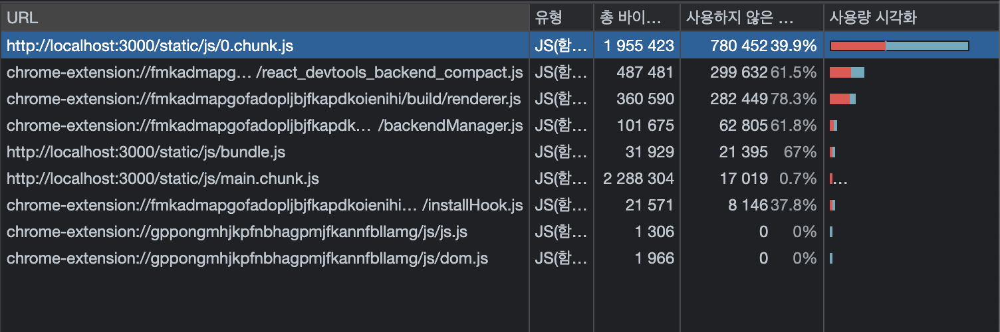

### Coverage 패널

- 렌더링하는 과정에서 어떤 코드가 실행되었는지 확인
- 각 파이르이 코드가 얼마나 실행되었는지 비율로 확인

### Squoosh

- 이미지 압축 도구로 이미지의 포맷이나 사이즈를 변경할 수 있음

### PurgeCSS

- 사용하지 않는 CSS를 제거해주는 툴
- CLI 혹은 웹팩과 같은 번들러에 플러그인으로 추가할 수 있음

<aside>
💡 **테일윈드**
유틸리티-퍼스트 CSS 프레임워크.
미리 특정 CSS 속성에 대해 클래스를 만들고, 그것을 활용하는 것.

</aside>

## 이미지 지연 로딩

### 네트워크 분석

- 영상이 가장 첫 화면에 보이는데, 제일 늦게 로딩 됨.
  - 해당 문제를 위해 이미지를 필요한 순간에 다운로드 되도록 지연로딩을 활용.
    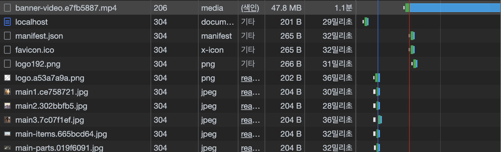

### Intersection Observer

- scroll 이벤트를 활용하면, 브라우저의 메인 스레드에 무리가 갈 수 있음 ⇒ 옵저버 활용
- 브라우저에서 특정 요소가 화면에 포함이 되는지 여부를 알려줌.
- 특정 요소가 화면에 들어왔을 때만, 함수가 호출 됨.

  ```jsx
  const options = {
  	root: document.querySelector('#scrollArea'), // 뷰포트 요소
  	rootMargin: '0px', // root요소의 여백(뷰포트의 범위를 가상으로 축소, 확대)
    threshold: 1.0
  	// 가시성 퍼센티지
  	// 1.0 : 모두 보이면 실행, 0 : 1px이라도 보이면 콜백
  }

  let callback = (entries, observer) => {
    entries.forEach(entry => {
      // 각 entry는 가시성 변화가 감지될 때마다 발생하고 그 context를 나타냅니다.
      // target element:
      //   entry.boundingClientRect
      //   entry.intersectionRatio
      //   entry.intersectionRect
      //   entry.isIntersecting
      //   entry.rootBounds
      //   entry.target
      //   entry.time
    });
  };

  // options에 따라 인스턴스 생성
  const observer = new IntersectionObserver(callback, options);

  // 타겟 요소 관찰 시작
  observer.observe(document.querySelector('#listItem'););
  ```

- 적용

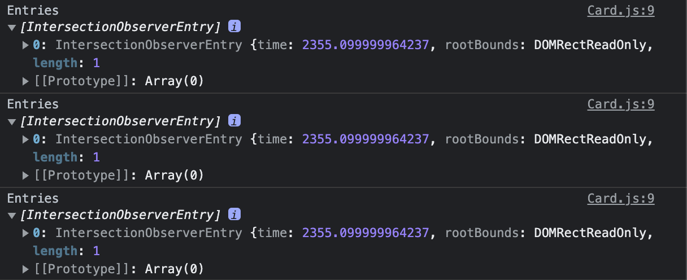

### 이미지에 I/O 적용하기

- 이미지 로딩은 img태그에 src가 할당되는 순간 일어남.
  - 최초에 img태그에 src 값을 할당하지 않다가 콜백이 실행되는 순간 src를 할당하여 이미지 지연로딩을 적용할 수 있음.
- dataset 속성을 활용하여 img src 정보 기록 → 화면 등장 → data-src를 src 속성에 넣기 → obsever 제거
- 코드

  ```jsx
  useEffect(() => {
    const options = {};
    const cb = (entries, observer) => {
      console.log('Entries', entries);
      entries.forEach((entry) => {
        if (entry.isIntersecting) {
          entry.target.src = entry.target.dataset.src;
          observer.unobserve(entry.target); // 이미 로딩된 객체 observe 해제
        }
      });
    };

    const observer = new IntersectionObserver(cb, options);
    observer.observe(imgRef?.current);
    return () => observer.disconnect();
  }, []);

  // ..
  ;
  // ..
  ```

- 효과
  - 이미지 다운로드를 뒤로 미루어, 첫 화면에 보이는 영상의 로딩에 문제가 없도록 함.

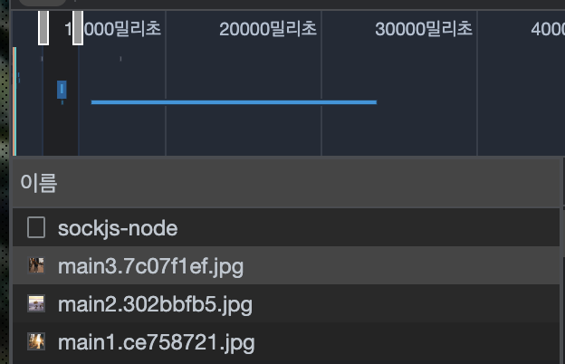

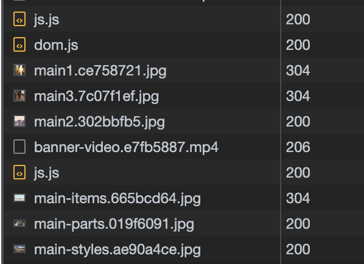

## 이미지 사이즈 최적화

### 느린 이미지 로딩 분석

- 이미지 위치에 도달하는 순간 로드하기 때문에, 이미지가 천천히 로드되는 현상이 느껴짐.

### 이미지 포맷 종류

- PNG
  - 무손실 압축 방식으로 원본 훼손없이 압축
  - 알파채널을 지원하는 포맷 (투명도 의미)
  - 배경 색을 투명하게 하여 뒤에 있는 요소가 보이는 이미지 가능
- JPG (JPEG)
  - 정보 손실 발생
  - 이미지를 더 작은 사이즈로 줄일 수 있음
  - 투명도 정보가 필요한게 아니라면 JPG
- WebP
  - 무손실 압축과 손실 압축 모두 제공
  - JPG나 PNG에 비해 효율적으로 이미지를 압축할 수 있음
  - 단, 브라우저 호환성에 문제가 있음

### squoosh를 사용하여 이미지 변환

- JPG 또는 PNG 포맷의 이미지를 WebP 포맷으로 변환하기
- 기존 이미지 정보 및 용량
  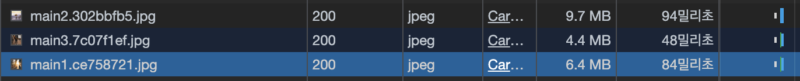
- squoosh를 통한 압축 진행
  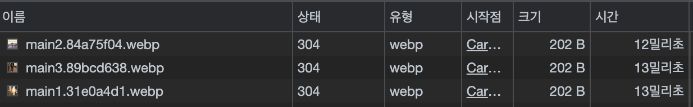
- 단, WebP는 브라우저 호환성이 좋지 못하여 호환성에 따라 다른 이미지를 로딩해주어야 함.
- picture 태그
  - 브라우저 호환성 + 조건에 따라서 상위에 있는 자원을 먼저 시도(?)하고 안되면, 하단으로 내려감.
  ```html
  <picture>
    <source
      media="(min-width: 700px)"
      srcset="/examples/images/people_960.jpg"
    />
    <source
      media="(min-width: 400px)"
      srcset="/examples/images/people_575.jpg"
    />
    
  </picture>
  ```
- 프로젝트에 적용하기

  ```jsx
  useEffect(() => {
    const options = {};
    const cb = (entries, observer) => {
      entries.forEach((entry) => {
        if (entry.isIntersecting) {
          const target = entry.target;
          const prevSibling = target.previousSibling;
          const prev2Sibling = prevSibling.previousSibling;

          target.src = target.dataset.src;
          prevSibling.srcset = prevSibling.dataset.srcset;
          prev2Sibling.srcset = prev2Sibling.dataset.srcset;

          observer.unobserve(entry.target);
        }
      });
    };

    const observer = new IntersectionObserver(cb, options);
    observer.observe(imgRef?.current);
    return () => observer.disconnect();
  }, []);

  <picture>
    <source data-srcset={props.webp} type="image/webp" />
    <source data-srcset={props.image} type="image/jpg" />
    
  </picture>;
  ```

  - 주의할 점
    - 내 환경에서는 img 소스도 source에 그대로 하나 더 만들어줘야 한다.
    - source에서는 src가 아니라 srcset이다

## 동영상 최적화

### 분석

- 영상을 나누어서 다운로드 함.
  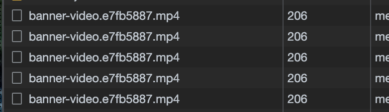

### 압축

- [Media.io](https://www.media.io/) 를 통해서 미디어를 압출 할 수 있음
- WepM은 WebP와 비슷하게 웹에 최적화된 포맷임
- 압축된 동영상 적용을 위해 source 태그를 활용할 수 있음
  ```html
  <video width="320" height="240" controls>
    <source src="movie.mp4" type="video/mp4" />
    <source src="movie.ogg" type="video/ogg" />
    Your browser does not support the video tag.
  </video>
  ```
- 화질저하를 감추기 위해 블러 효과를 넣을 수 있음
  ```css
  filter: blur(10px);
  ```

## 폰트 최적화

- 폰트의 변화


### FOUT, FOIT

[참고자료 - 네이버 D2](https://d2.naver.com/helloworld/4969726?fbclid=IwAR3_12Ifl9-yM0TP_21XFNN6Pl3PVYuMH9kLPPFVclfdyOn4asKlhI1ZRCM)

- 폰트의 변화로 발생하는 위 현상을 FOUT(Flash of Unstyled Text) 또는 FOIT(Flash of Invisivble Text)라고 함.
- FOUT는 먼저 텍스트 보여주고, 스타일 로드되면 ㄱ.
- FOIT는 폰트가 없으면, 텍스트 자체를 안 보여줌.

### 최적화 방법

- 폰트 적용시점 제어하기
  [참고자료 - 네이버 D2](https://d2.naver.com/helloworld/4969726?fbclid=IwAR3_12Ifl9-yM0TP_21XFNN6Pl3PVYuMH9kLPPFVclfdyOn4asKlhI1ZRCM) - CSS font-display 속성을 통해 제어가능 - block: FOIT (타임아웃 3초)
  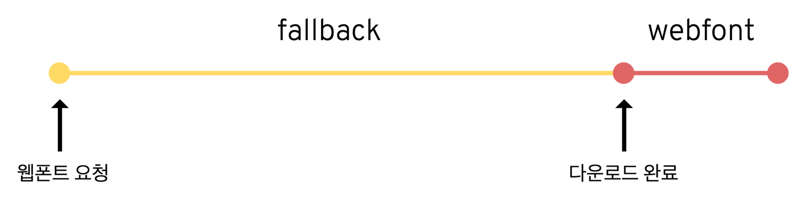

          - swap: FOUT

  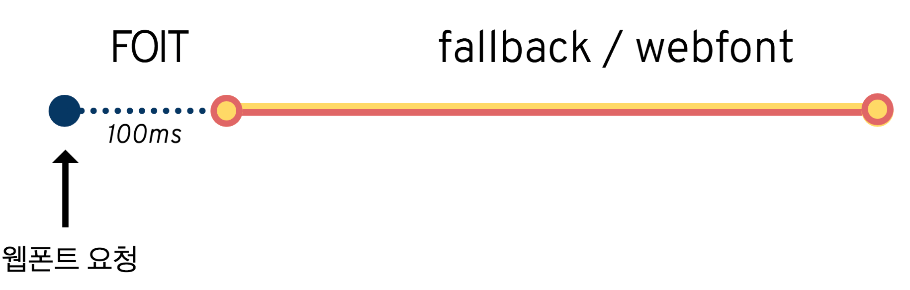

          - fallback: FOIT (타임아웃 0.1초) 3초 후에도 불러오지 못한 경우 기본 폰트 유지, 이후 캐시
          - optional: FOIT (타임아웃 0.1초) 네트워크 상태에 따라 기본 폰트로 유지할지 결정, 이후 캐시

  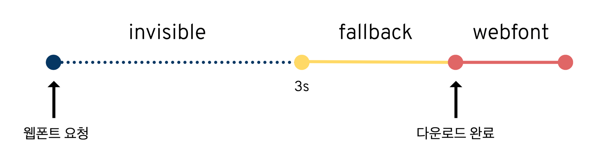

      - 코드

          ```css
          @font-face {
            font-family: BMYEONSUNG;
            src: url('./assets/fonts/BMYEONSUNG.ttf');
            font-display: fallback;
          }
          ```

- 적용

  - 해당 자료에서는 FOIT 방식으로 활용할 것인데, 폰트가 다운로드 되었을 때, 텍스트가 fade-in으로 보여질 수 있도록 할 것임. by JS (fontfaceobserver)
  - fontfaceobserver는 폰트가 다운로드 되었는지 알 수 있음.
  - 코드

    ```jsx
    const font = new FontFaceObserver('BMYEONSUNG');

    function BannerVideo() {
      const [isFontLoaded, setIsFontLoaded] = useState(false);

      useEffect(() => {
        font.load(null, 20000).then(() => {
          // 2초 안에 다운로드 안되면, promise에러 던짐.
          console.log('font downloaded');
          setIsFontLoaded(true);
        });
      }, []);

    ///.....
    ```

- 폰트 사이즈 줄이기
  - 일반적으로 TTF 및 OTF 포맷을 활용
  - 파일 크기 순
    1. EOT
    2. TTF/OTF
    3. WOFF
    4. WOFF2
  - 웹 환경에서는 Web Open Font Format이 좋음.
    단, 브라우저 호환성 문제가 있음.
  - 용량차이
    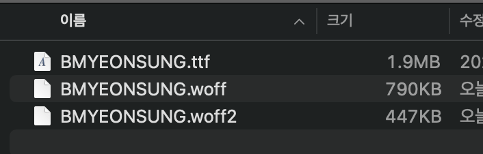
  - 코드
    ```css
    @font-face {
      font-family: BMYEONSUNG;
      src: url('./assets/fonts/BMYEONSUNG.woff2') format('woff2'), url('./assets/fonts/BMYEONSUNG.woff')
          format('woff'), url('./assets/fonts/BMYEONSUNG.ttf') format('ttf');
      font-display: fallback;
    }
    // src에 우선순위를 두어, 브라우저 호환성에 맞도록 세팅할 수 있음.
    ```
- 폰트를 파일형태가 아니라, Data-URI 형태로 CSS 파일에 포함할 수 있음
  - 별도의 네트워크 요청이 필요없음.
  - 단, 초기 CSS 파일 자체의 용량이 커질 수 있음.
  ```css
  url('data:font/woff2;charset=utf-8;base64,d09G...) format('woff2'),
  ```

### 캐시 최적화

### 종류

- 메모리 캐시 : RAM에 저장
- 디스크 캐시 : 디스크에 파일 형태로 저장
- 어떤 캐시를 사용할지 제어할 수는 없음. 브라우저가 사용 빈도나 파일 크기에 따라 특정 알고리즘에 의해 판단.

<aside>
💡 Cache-Control 헤더를 통해 브라우저가 어떻게 캐싱할 것인지 판단.

</aside>

### Cache-Control

- 옵션
  - no-cache: 캐시를 사용하기 전 서버에 검사후 사용
  - no-store: 캐시 사용 안 함
  - public: 모든 환경에서 캐시 사용가능.
  - private: 브라운저 환경에서만, 외부 캐시 서버는 사용 불가
  - max-age: 캐시의 유효 시간
- max-age 혹은 no-cache

  - 유효시간 만료 이후, 캐싱된 리소스를 그대로 사용할지, 아니면 새롭게 다운로드 할지 서버에 확인
  - 만약, new가 없다면 304응답으로 캐싱 활용. Status Code: 304 Not Modified
    <aside>
    💡 **캐싱된 값이 최신 리소스인지 어떻게 체크할까**
    캐시된 리소스의 응답 헤더에 있는 Etag값과 서버에 있는 최신 리소스의 Etag값을 비교하여 캐시된 리소스가 최신인지 아닌지 판단함.

    </aside>

### 적절한 캐시 유효 시간

- 일반적으로 HTML은 no-cache
- JS,CSS 파일들은 빌드시 파일이 변경되면, 이름도 변경됨. (다른 파일이 됨.)
  ```jsx
  const header = {
    setHeaders: (res, path) => {
      if (path.endsWith('.html')) {
        res.setHeader('Cache-Control', 'no-cache');
      } else if (
        path.endsWith('.js') ||
        path.endsWith('.css') ||
        path.endsWith('.webp')
      ) {
        res.setHeader('Cache-Control', 'public', 'max-age=31536000');
      } else {
        res.setHeader('Cache-Control', 'no-store');
      }
    },
  };
  ```

## 불필요한 CSS 제거

- 범위 탭에서 다운로드한 파일의 사용량을 확인할 수 있음.
  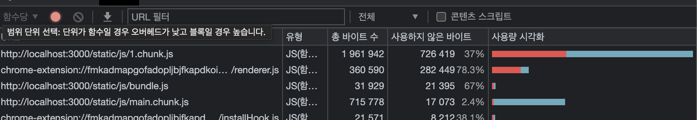

### Purge CSS

- 파일에 있는 모든 쿼드를 추출하여, 필요한 CSS 만 보존함.

```bash
$ yarn add --dev purgecss
$ purgecss -css ./build.static/*.css --output ./build/static/ --content ./build/index.html ./build/static/js/*.js
```

- 옵션
  - —css : 불필요한 클래스 제거
  - —output: 동일한 위치에 덮어쓰도록
  - —content: 키워드를 추출할 위치
- 주의사항

  - purgecss 에서 테일윈드 키워드 lg:m-8을 정상ㅈ거으로 파싱하지 못할 수 있음.
  - 해당 문제를 defaultExtractor 옵션을 통해 해결 가능 + Shell 명령어

    ```jsx
    module.exports = {
      defaultExtractor: (content) => content.match(/[\w\:\-]+/g) || [],
    };

    // shell에 --config ./purgecss.config.css 추가
    ```
