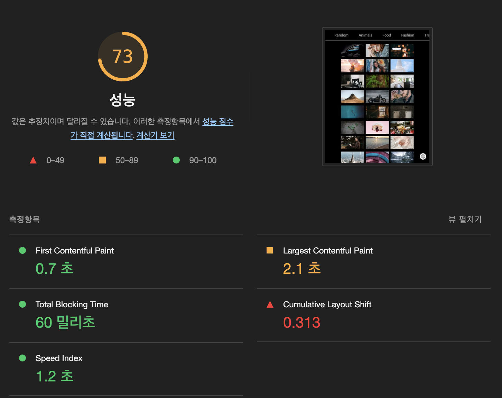
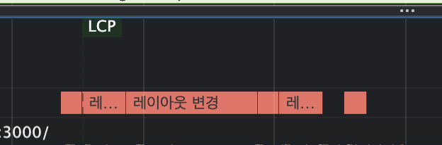
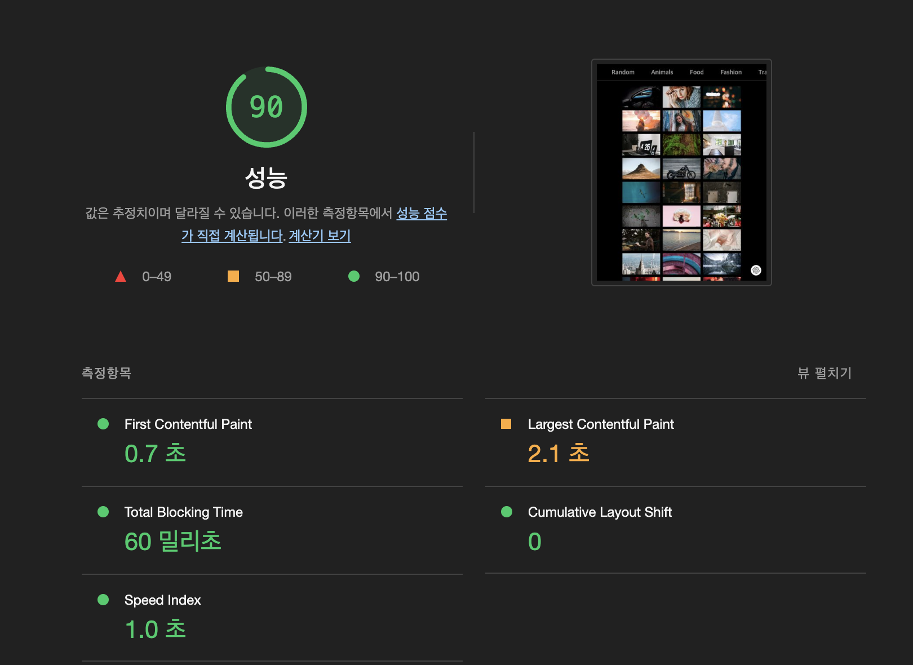
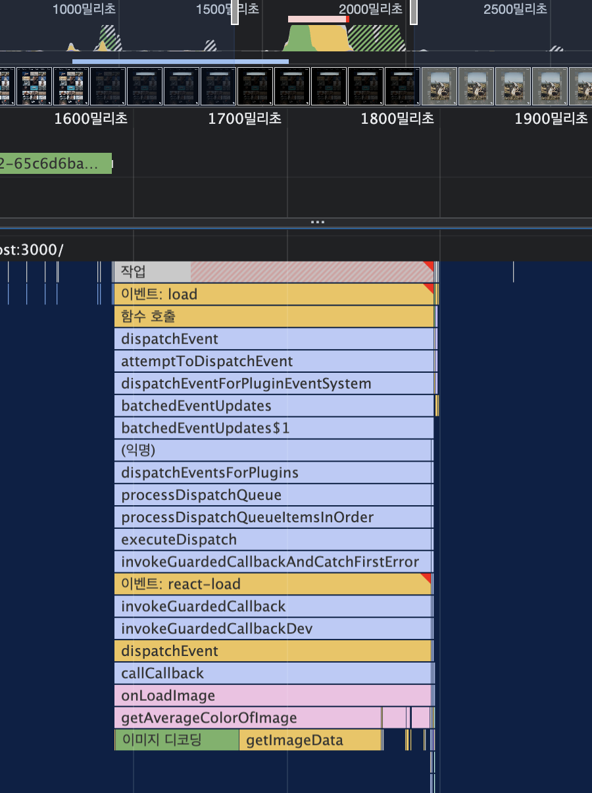
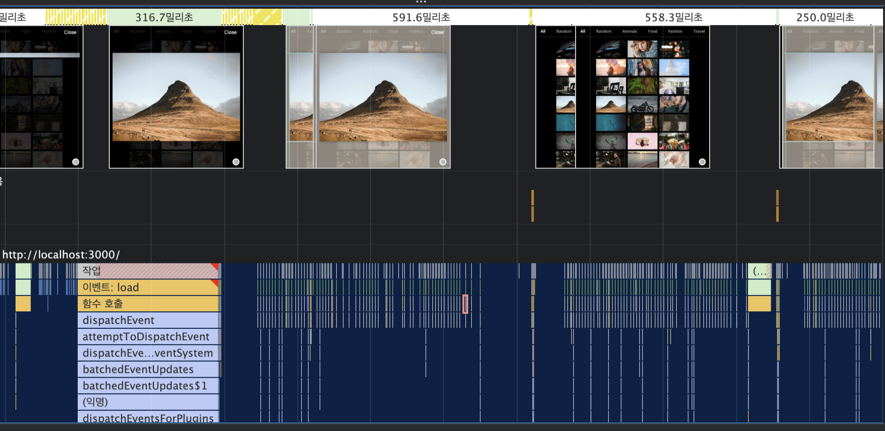
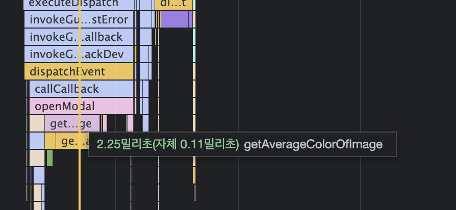

# fe 성능 최적화 #4 이미지 갤러리 최적화

## WHAT TO 최적화

### 이미지 지연 로딩

- Intersection Observer API가 아니라, 라이브러리 활용하기.

### 레이아웃 이동 피하기 Layout Shift

- 주로 이미지 로딩과정에서 자주 발생

### 리덕스 렌더링 최적화

- 리덕스의 useSelector 훅을 통해 손쉽게 리덕스에 저장된 데이터를 가져올 수 있음.
- 단, 해당 과정에서 다양한 성능 문제가 발생함.

### 병목 코드 최적화

- 메모이제이션 방법을 활용한 최적화

## 탐색

- 이미지 모달에 hue 그라데이션 효과가 있음 ⇒ 속도가 느림.
- 리덕스를 활용한 프로젝트
  - 포토리스트컨테이너에서 이미지를 서버에서 받아옴.
    1. 해당 정보는 redux/photo.js 에서 처리됨.
    2. 해당 컴포넌트에서는 useSelector로 저장된 정보를 가져옴 with 필터기능.
  - 포토아이템 컴포넌트에서는 dispatch를 화용하여 모달을 제어함.
    1. dispatch를 통해서 전달되는 showModal함수는 액션 생성자로, 리듀서에서 특정 동작을 실행하기 위한 정보를 전달해줌.
    2. 해당 dispatch를 통해 상태 값을 바꾸면, 이 상태를 구독하고 있는 ImageModalContainer는 해당 상태를 반영하여 ImageModal 컴포넌트를 화면에 띄움
  - 이미지모달 컴포넌트
    1. 이미지의 정보가 로드되면, dispatch를 통해 백그라운드 색상을 지정함.
- 라이트 하우스 점수
  

## 레이아웃 이동 피하기

- 이미지 로딩에 따라 가운데 부분에 있는 이미지가 생기면서 레이아웃이 밀리는 현상
- 해당 지표를 얻기 위해, CLS 항목을 활용할 수 있음.
  - 레이아웃 이동이 발생하지 않으면 0, 발생하면 1. (0.1 이하가 권장)
  - 성능 탭의 레이아웃 변경 요소 체크
    

### 원인

- 사이즈가 미리 정의되지 않은 이미지, 광고
- 동적으로 삽입된 컨텐츠
- 웹 폰트 FOUT, FOIT

### 해결

- 레이아웃 이동을 유발하는 요소의 사이즈를 지정하기
- 단, 일부 요소는 환경에 따라 사이즈가 변함 ⇒ 이미지의 비율로 사이즈 확보하기

  - 전통적인 방법으로, padding을 이용하여 박스를 만든 뒤, 그 안에 이미지를 absolute로 띄우는 방식

    ```html
    <div class="wrapper">
      
    </div>

    <style>
      .wrapper {
        position: relative;
        width: 160px;
        padding-top: 56.25%; /* 16 : 9 비율 */
      }

      .img {
        position: absolute;
        width: 100%;
        height: 100%;
        top: 0;
        left: 0;
      }
    </style>

    /* 매번 계산이 필요한 복잡한 방식 */
    ```

  - aspect-ratio 를 활용한 CSS 속성 활용하기

    ```css
    .wrapper {
      width: 100%;
      aspect-ratio: 16/9;
    }

    .img {
      width: 100%;
      height: 100%;
    }
    ```

- 개선된 라이트하우스 점수 결과
  

## 이미지 지연 로딩

- Intersection Observer가 아닌, 이미지 지연 로딩을 통한 해결

```bash
yarn add react-lazyload
```

## 리덕스 렌더링 최적화

### 리액트의 렌더링

- 리액트는 렌더링 사이클을 가짐.
- 서비스의 상태가 변경되면 화면에 반영하기 위해 리렌더링 과정을 거침.
- 그래서, 렌더링에 시간이 오래걸리는 코드가 있거나 렌더링이 불필요한 컴포넌트 등 때문에, 메인 스레드의 리소스를 차지하여 성능에 영향을 줌.

### 문제

- 이미지 모달 클릭시, 모달 뿐 아니라 헤더와 이미지 리스트 컴포넌트까지 리렌더링되고 있음.
  1. 모달이 열릴 때
  2. 백그라운드 색상이 추가될 때
  3. 모달이 닫힐 때

### 원인

- 리덕스 때문.
  - 서비스에서 사용하는 이미지 리스트와 헤더의 카테고리, 모달 정보는 리덕스가 관리.
  - 컴포넌트들은 리덕스의 상태를 구독하여 상태가 변했을 때를 감지하고 리렌더링함.
  - 즉, 리덕스 상태를 구독하고 있는 컴포넌트는 리덕스 상태에 따라 불필요하게 리렌더링 될 수 있다는 것.
- 문제 발생 컴포넌트
  - 이미지 갤러리
  - 이미지 모달
  - dispatch를 통해 스토어 상태를 변경시키면, 리덕스의 상태가 변함 ⇒ 리덕스를 구독하고 있는, 즉 useSelector를 사용하고 있는 컴포넌트가 전부 리렌더링 됨.

<aside>
💡 **왜 관련없는 녀석한테 영향을 주는 것일까?**
- useSelector의 작동 방식이 문제.
- useSelector는 서로 다른 상태를 참조할 때는 리렌더링을 하지 않도록 구현되어 있음.
- 하지만, 그 판단 기준이 useSelector에 인자로 넣은 함수의 반환 값.
- 반환 값이 이전 값과 같다면 영향을 끼치지 않지만, 이전 값과 다르면 리렌더링…

</aside>

- 하기와 같이 객체를 새로 만들어서 새로운 참조 값을 반환하는 형태임. 다른 곳도 마찬가지
  ```jsx
  const { photos, loading } = useSelector(state => ({
    photos:
      state.category.category === 'all'
        ? state.photos.data
        : state.photos.data.filter(photo => photo.category === state.category.category),
    loading: state.photos.loading,
  }));
  ```

### 해결하기

- useSelector문제 해결하기
  1. 객체를 새로 문들지 않도록 반환 값을 나누기
  2. Equality Function을 사용하기
- 객체를 새로 문들지 않도록 반환 값을 나누기

  ```jsx
  // const { modalVisible, bgColor, src, alt } = useSelector(state => ({
  //   modalVisible: state.imageModal.modalVisible,
  //   bgColor: state.imageModal.bgColor,
  //   src: state.imageModal.src,
  //   alt: state.imageModal.alt,
  // }));

  const modalVisible = useSelector(state => state.ImageModal.modalVisible);
  const bgColor = useSelector(state => state.ImageModal.bgColor);
  const src = useSelector(state => state.ImageModal.src);
  const alt = useSelector(state => state.ImageModal.alt);
  ```

  - 이렇게 나누어서 반환하면, 참조 값이 바뀌는 것이 아니므로, useSelector가 반환하는 값은 다른 상태에 영향을 받지 않음 ⇒ 리렌더링 X

- 새로운 Equality Function 활용하기
  - useSelector에 옵션으로 넣는 함수
  - 리덕스의 상태가 변했을 때, useSelector가 반환해야 하는 값에도 영향을 미쳤는지 판단하는 함수.
    - 객체의 값만을 비교하여 차이를 비교
  ```jsx
  const { modalVisible, bgColor, src, alt } = useSelector(
    state => ({
      modalVisible: state.imageModal.modalVisible,
      bgColor: state.imageModal.bgColor,
      src: state.imageModal.src,
      alt: state.imageModal.alt,
    }),
    shallowEqual // react-redux 에서 제공함.
  );
  ```
- 해당 기능을 적용하고, 이미지 모달을 띄우면 이전과 달리 이미지 리스트가 렌더링되지 않음.
- 하지만, 다른 카테고리에서 이미지 모달을 띄어보면 여전히 보달과 상관업슨 이미지 리스트가 리렌더링 됨

  - filter메소드에 의해 새로운 참조 값이 생기기 때문.
  - state.photos.data와 state.category.category를 따로 꺼낸 후, useSelector 밖에서 필터링 해야함.
  - 데이터는 다 가져오고 필터링 작업을 따로 빼서 한다는 것

  ```jsx
  const { category, allPhotos, loading } = useSelector(
    state => ({
      allPhotos: state.photos.data,
      category: state.category.category,
      loading: state.photos.loading,
    }),
    shallowEqual
  );

  const photos =
    category === 'all' ? allPhotos : allPhotos.filter(photo => photo.category === category);
  ```

## 병목 코드 최적화

### 이미지 모달 분석

1. 페이지가 최초로 로드 될 때
2. 카테고리를 변경했을 때
3. 이미지 모달을 띄웠을 때

### 성능



- 이미지의 전체 평균 값을 계산하는데, 많은 리소스가 소요됨을 알 수 있음

### getAverageColorOfImage 함수 분석

- 캔버스에 이미지를 올리고 픽셀 정보를 불러온 뒤 하나씩 더해서 평균을 내는 함수.
- 문제점
  - 큰 이미지를 통째로 캔버스에 올린다는 것.
  - 반복문을 통해 픽셀 정보를 계산한다는 것.

### 메모이제이션으로 최적화하기

- 한 번 실행된 함수에 대해 결과를 기억해 두었다가 똑같은 조건으로 실행되었을 때, 함수의 코드를 모두 실행하지않고 기억된 값을 활용하는 것.
- 결과 - 동일한 모달 로딩 시간 단축
  

### 코드 개선

- 이미지가 작으면 캔버스에 그리는 이미지의 사이즈도 작아짐.
- 원본이 아니라, 썸네일 이미지로 사진을 분석하면 어떨까

```jsx
const openModal = e => {
  dispatch(showModal({ src: urls.full, alt }));

  // 썸네일 이미지로 배경색 계산 후, 리덕스에 저장
  const averageColor = getAverageColorOfImage(e.target);
  dispatch(setBgColor(averageColor));
};
```

- 썸네일 이미지로 색상을 분석하고 → dispatch → full이미지 다운로드 되기 전에 백그라운드 색상 지정 됨.
  
